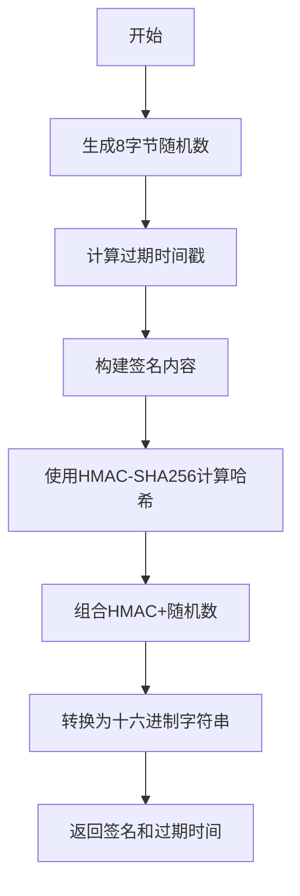

# 🔐 File Uploader 签名算法详解

本文档详细说明 File Uploader 使用的 HMAC-SHA256 签名算法的实现原理、生成方法和验证流程。

## 📋 算法概述

File Uploader 使用 **HMAC-SHA256** 签名算法来确保 API 调用的安全性，防止未授权访问和请求篡改。

### 🎯 设计目标
- **防重放攻击**: 通过时间戳和随机数防止请求重放
- **防篡改**: 通过签名验证确保请求内容未被修改
- **访问控制**: 只有拥有正确密钥的客户端才能生成有效签名
- **时效性**: 签名具有过期时间，限制有效期

## 🔧 签名算法详解

### 1. **签名组成结构**

最终签名由两部分组成：
```
签名 = HMAC-SHA256(签名内容) + 随机数
总长度 = 32字节(HMAC) + 8字节(随机数) = 40字节
编码后 = 80个十六进制字符
```

### 2. **签名内容构建**

签名内容格式：
```
签名内容 = 文件路径 + 过期时间戳 + 随机数(十六进制)
```

**示例**：
```
路径: /api/v1/upload
过期时间: 1735977600
随机数: a1b2c3d4e5f60708
签名内容: /api/v1/upload1735977600a1b2c3d4e5f60708
```

### 3. **完整生成流程**



## 💻 实现代码

### 🔹 Go语言实现

```go
package main

import (
    "crypto/hmac"
    "crypto/rand"
    "crypto/sha256"
    "encoding/hex"
    "fmt"
    "strconv"
    "time"
)

// generateSignature 生成HMAC-SHA256签名
func generateSignature(path string, expiryDuration time.Duration, secretKey string) (string, int64, error) {
    // 1. 计算过期时间戳
    expires := time.Now().Add(expiryDuration).Unix()
    expiresStr := strconv.FormatInt(expires, 10)

    // 2. 生成8字节随机数
    nonce := make([]byte, 8)
    if _, err := rand.Read(nonce); err != nil {
        return "", 0, fmt.Errorf("生成随机数失败: %v", err)
    }

    // 3. 构建签名内容：路径 + 过期时间 + 随机数
    signContent := path + expiresStr + hex.EncodeToString(nonce)

    // 4. 计算HMAC-SHA256
    h := hmac.New(sha256.New, []byte(secretKey))
    h.Write([]byte(signContent))
    hmacBytes := h.Sum(nil)

    // 5. 组合最终签名：HMAC + 随机数
    finalSignature := append(hmacBytes, nonce...)

    // 6. 转换为十六进制字符串
    signatureHex := hex.EncodeToString(finalSignature)

    return signatureHex, expires, nil
}

// verifySignature 验证签名
func verifySignature(path, expires, signature, secretKey string) bool {
    // 1. 解码签名
    signatureBytes, err := hex.DecodeString(signature)
    if err != nil {
        return false
    }

    // 2. 检查签名长度（40字节）
    if len(signatureBytes) != 40 {
        return false
    }

    // 3. 提取HMAC和随机数
    hmacBytes := signatureBytes[:32]  // 前32字节是HMAC
    nonceBytes := signatureBytes[32:] // 后8字节是随机数

    // 4. 重新构建签名内容
    signContent := path + expires + hex.EncodeToString(nonceBytes)

    // 5. 计算期望的HMAC
    h := hmac.New(sha256.New, []byte(secretKey))
    h.Write([]byte(signContent))
    expectedHMAC := h.Sum(nil)

    // 6. 使用恒定时间比较防止时序攻击
    return hmac.Equal(hmacBytes, expectedHMAC)
}

func main() {
    secretKey := "your-secret-key-change-this-in-production"
    path := "/api/v1/upload"
    
    // 生成签名
    signature, expires, err := generateSignature(path, time.Hour, secretKey)
    if err != nil {
        fmt.Printf("生成签名失败: %v\n", err)
        return
    }
    
    fmt.Printf("路径: %s\n", path)
    fmt.Printf("过期时间: %d (%s)\n", expires, time.Unix(expires, 0).Format("2006-01-02 15:04:05"))
    fmt.Printf("签名: %s\n", signature)
    
    // 验证签名
    expiresStr := strconv.FormatInt(expires, 10)
    isValid := verifySignature(path, expiresStr, signature, secretKey)
    fmt.Printf("签名验证: %t\n", isValid)
}
```

### 🔹 TypeScript/JavaScript 实现

```typescript
import crypto from 'crypto';

interface SignatureResult {
  signature: string;
  expires: number;
}

/**
 * 生成HMAC-SHA256签名
 */
function generateSignature(
  path: string, 
  expiryDuration: number = 3600, 
  secretKey: string
): SignatureResult {
  // 1. 计算过期时间戳
  const expires = Math.floor(Date.now() / 1000) + expiryDuration;
  const expiresStr = expires.toString();

  // 2. 生成8字节随机数
  const nonce = crypto.randomBytes(8);
  const nonceHex = nonce.toString('hex');

  // 3. 构建签名内容：路径 + 过期时间 + 随机数
  const message = path + expiresStr + nonceHex;

  // 4. 计算HMAC-SHA256
  const hmac = crypto.createHmac('sha256', secretKey);
  hmac.update(message);
  const hmacBytes = hmac.digest();

  // 5. 组合最终签名：HMAC + 随机数
  const finalSignature = Buffer.concat([hmacBytes, nonce]);
  const signature = finalSignature.toString('hex');

  return { signature, expires };
}

/**
 * 验证签名
 */
function verifySignature(
  path: string, 
  expires: string, 
  signature: string, 
  secretKey: string
): boolean {
  try {
    // 1. 解码签名
    const signatureBuffer = Buffer.from(signature, 'hex');
    
    // 2. 检查签名长度（40字节）
    if (signatureBuffer.length !== 40) {
      return false;
    }

    // 3. 提取HMAC和随机数
    const hmacBytes = signatureBuffer.subarray(0, 32);
    const nonceBytes = signatureBuffer.subarray(32);

    // 4. 重新构建签名内容
    const message = path + expires + nonceBytes.toString('hex');

    // 5. 计算期望的HMAC
    const expectedHmac = crypto.createHmac('sha256', secretKey);
    expectedHmac.update(message);
    const expectedHmacBytes = expectedHmac.digest();

    // 6. 使用恒定时间比较
    return crypto.timingSafeEqual(hmacBytes, expectedHmacBytes);
  } catch (error) {
    return false;
  }
}

// 使用示例
const secretKey = 'your-secret-key-change-this-in-production';
const path = '/api/v1/upload';

const result = generateSignature(path, 3600, secretKey);
console.log('路径:', path);
console.log('过期时间:', result.expires, new Date(result.expires * 1000).toLocaleString());
console.log('签名:', result.signature);

const isValid = verifySignature(path, result.expires.toString(), result.signature, secretKey);
console.log('签名验证:', isValid);
```

### 🔹 Python 实现

```python
import hmac
import hashlib
import secrets
import time
from typing import Tuple

def generate_signature(path: str, expiry_duration: int = 3600, secret_key: str) -> Tuple[str, int]:
    """生成HMAC-SHA256签名"""
    # 1. 计算过期时间戳
    expires = int(time.time()) + expiry_duration
    expires_str = str(expires)
    
    # 2. 生成8字节随机数
    nonce = secrets.token_bytes(8)
    nonce_hex = nonce.hex()
    
    # 3. 构建签名内容：路径 + 过期时间 + 随机数
    message = path + expires_str + nonce_hex
    
    # 4. 计算HMAC-SHA256
    hmac_bytes = hmac.new(
        secret_key.encode('utf-8'),
        message.encode('utf-8'),
        hashlib.sha256
    ).digest()
    
    # 5. 组合最终签名：HMAC + 随机数
    final_signature = hmac_bytes + nonce
    
    # 6. 转换为十六进制字符串
    signature_hex = final_signature.hex()
    
    return signature_hex, expires

def verify_signature(path: str, expires: str, signature: str, secret_key: str) -> bool:
    """验证签名"""
    try:
        # 1. 解码签名
        signature_bytes = bytes.fromhex(signature)
        
        # 2. 检查签名长度（40字节）
        if len(signature_bytes) != 40:
            return False
        
        # 3. 提取HMAC和随机数
        hmac_bytes = signature_bytes[:32]
        nonce_bytes = signature_bytes[32:]
        
        # 4. 重新构建签名内容
        message = path + expires + nonce_bytes.hex()
        
        # 5. 计算期望的HMAC
        expected_hmac = hmac.new(
            secret_key.encode('utf-8'),
            message.encode('utf-8'),
            hashlib.sha256
        ).digest()
        
        # 6. 使用恒定时间比较
        return hmac.compare_digest(hmac_bytes, expected_hmac)
    except Exception:
        return False

# 使用示例
if __name__ == "__main__":
    secret_key = "your-secret-key-change-this-in-production"
    path = "/api/v1/upload"
    
    # 生成签名
    signature, expires = generate_signature(path, 3600, secret_key)
    
    print(f"路径: {path}")
    print(f"过期时间: {expires} ({time.strftime('%Y-%m-%d %H:%M:%S', time.localtime(expires))})")
    print(f"签名: {signature}")
    
    # 验证签名
    is_valid = verify_signature(path, str(expires), signature, secret_key)
    print(f"签名验证: {is_valid}")
```

## 🔍 签名验证流程

### 服务器端验证步骤

1. **提取参数**: 从请求中获取 `expires` 和 `signature` 参数
2. **检查过期**: 验证当前时间是否超过过期时间
3. **解码签名**: 将十六进制签名解码为字节数组
4. **长度检查**: 确认签名长度为40字节
5. **分离组件**: 提取HMAC(32字节)和随机数(8字节)
6. **重建内容**: 使用路径、过期时间和随机数重建签名内容
7. **计算HMAC**: 使用服务器密钥计算期望的HMAC
8. **安全比较**: 使用恒定时间比较防止时序攻击

### 验证示例

```go
func (middleware *AuthMiddleware) validateRequest(c *gin.Context) bool {
    // 1. 获取参数
    expiresStr := c.Query("expires")
    signature := c.Query("signature")
    path := c.Request.URL.Path
    
    // 2. 检查参数完整性
    if expiresStr == "" || signature == "" {
        return false
    }
    
    // 3. 检查过期时间
    expires, err := strconv.ParseInt(expiresStr, 10, 64)
    if err != nil || time.Now().Unix() > expires {
        return false
    }
    
    // 4. 验证签名
    return verifySignature(path, expiresStr, signature, middleware.secretKey)
}
```

## 🛡️ 安全特性

### 1. **防重放攻击**
- **时间戳**: 每个签名都有过期时间
- **随机数**: 每次生成的签名都不同
- **一次性**: 相同请求的签名每次都不同

### 2. **防篡改**
- **完整性**: 任何参数修改都会导致签名验证失败
- **路径绑定**: 签名与特定API路径绑定

### 3. **防时序攻击**
- **恒定时间比较**: 使用 `hmac.Equal()` 或 `crypto.timingSafeEqual()`
- **避免信息泄露**: 比较时间不依赖于数据内容

### 4. **密钥安全**
- **服务器端存储**: 密钥只存储在服务器端
- **环境变量**: 建议通过环境变量配置密钥
- **定期轮换**: 支持密钥定期更换

## ⚙️ 配置参数

### 签名相关配置

```yaml
security:
  secret_key: "your-secret-key-change-this-in-production"  # 签名密钥
  signature_expiry: 3600  # 签名有效期（秒），默认1小时
```

### 推荐配置

- **开发环境**: `signature_expiry: 3600` (1小时)
- **生产环境**: `signature_expiry: 1800` (30分钟)
- **高安全环境**: `signature_expiry: 300` (5分钟)

## 🔧 使用示例

### API调用示例

```bash
# 1. 生成签名（通常在客户端后端完成）
signature="a1b2c3d4e5f6070812345678901234567890123456789012345678901234567890123456"
expires="1735977600"

# 2. 调用API
curl -X POST "https://your-domain.com/api/v1/upload?expires=${expires}&signature=${signature}" \
  -F "file=@example.jpg" \
  -F "storage=protected_images"
```

### 静态文件访问示例

```bash
# 需要签名的静态文件访问
curl "https://your-domain.com/protected/example.jpg?expires=1735977600&signature=abc123..."
```

## 📝 注意事项

### 1. **密钥管理**
- 使用强随机密钥（至少32字符）
- 不要在客户端代码中硬编码密钥
- 定期轮换密钥

### 2. **时间同步**
- 确保客户端和服务器时间同步
- 考虑网络延迟和时钟偏差

### 3. **错误处理**
- 签名验证失败时返回统一错误信息
- 不要泄露具体的验证失败原因

### 4. **性能考虑**
- HMAC计算开销较小
- 可以考虑缓存验证结果（谨慎使用）

---

*更多信息请参考 [API说明文档](api说明.md) 和 [调用说明文档](调用说明.md)*
